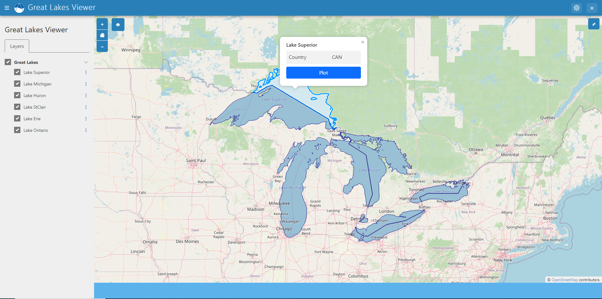
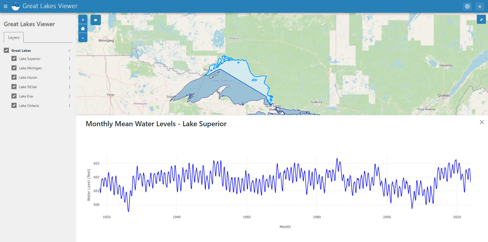

# Greate Lake Viewer

Data Sources:
- Great Lakes Shapefiles: https://github.com/Sonia-96/tethysapp-great_lakes_viewer/tree/update-readme
- Great Lakes Monthly Water Level Data: https://www.lrd.usace.army.mil/Water-Information/Water-Management/Great-Lakes-and-Harbors/Water-Level-Data/#monthly-mean-water-levels